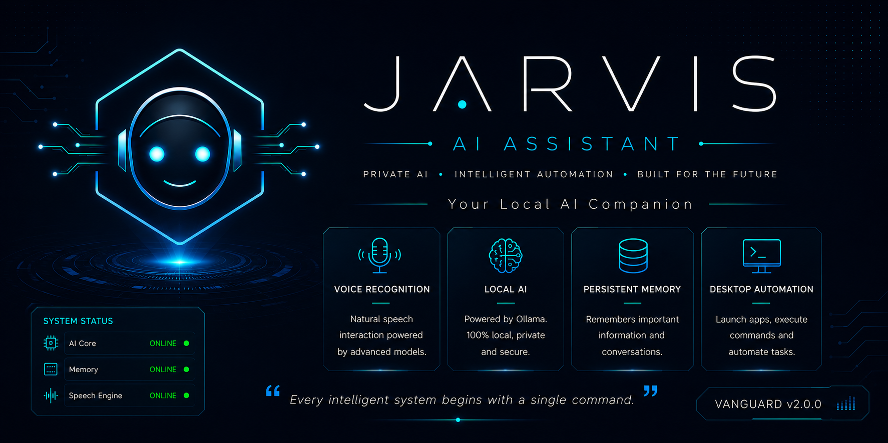
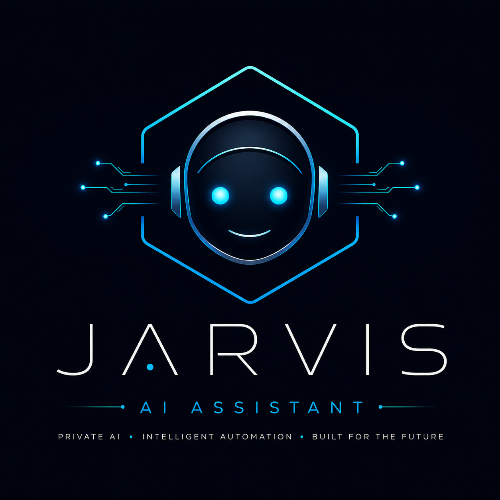
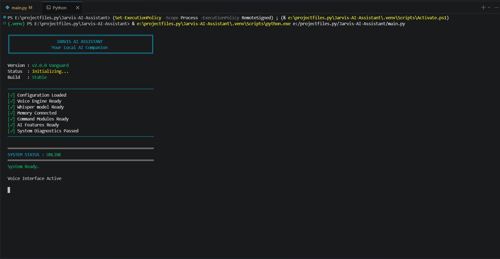
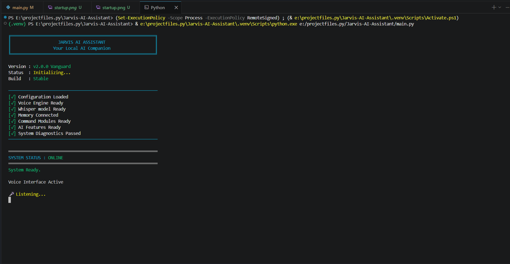
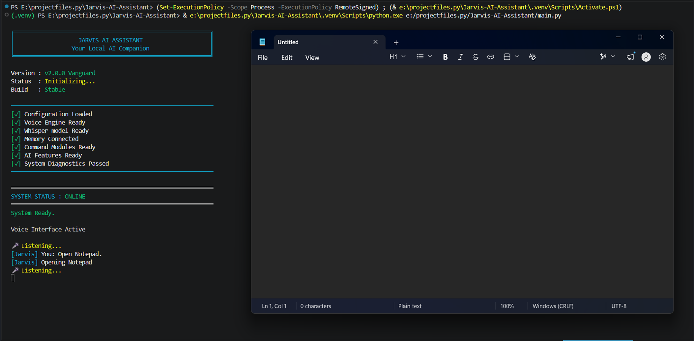
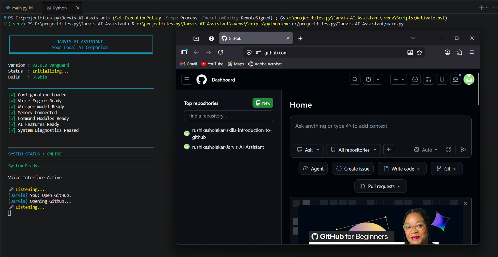
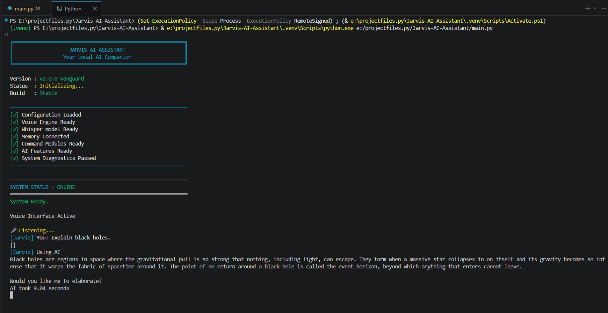
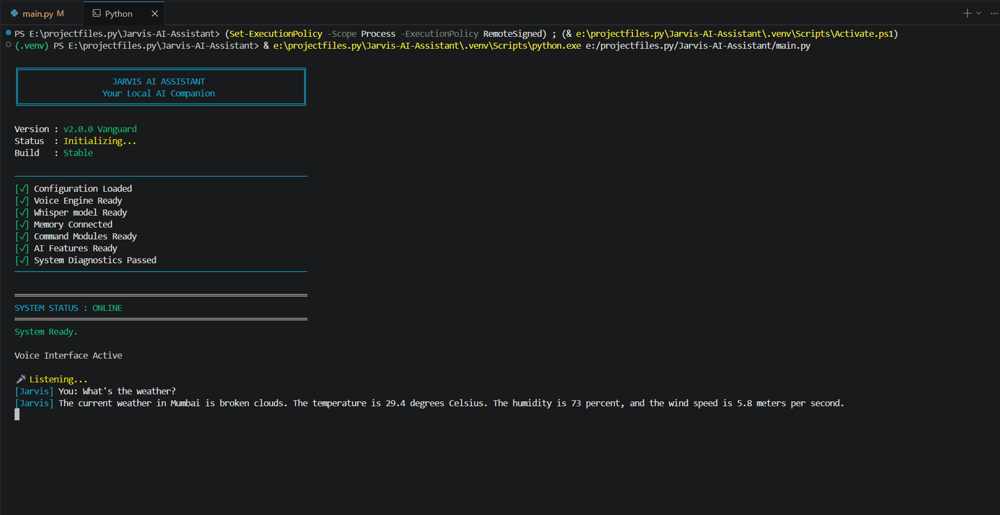
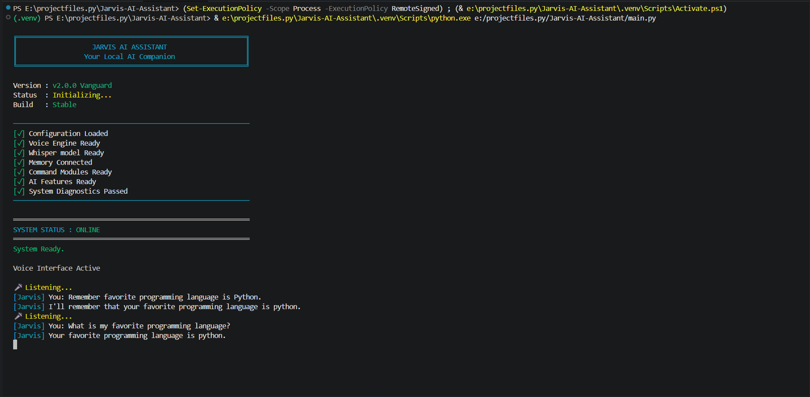

<div align="center">



<br><br><br>



# Jarvis AI Assistant

### Your Local AI Companion

Private AI • Intelligent Automation • Built for the Future

<br>


<br><br>

<i>"Every intelligent system begins with a single command."</i>

</div>


---

# 📡 System Status

| Module | Status |
|---------|--------|
| AI Core | 🟢 Online |
| Voice Recognition | 🟢 Online |
| Memory System | 🟢 Online |
| Desktop Automation | 🟢 Online |
| Development | 🟢 Active |

---

# 🚀 Current Release

**Version:** `v2.0.0`

**Codename:** `Vanguard • Initial Public Release`

**Release Status:** `🟢 Stable`

> *"The first official public release of Jarvis AI Assistant."*

---

# 🎯 Mission

Jarvis AI Assistant is a modular AI voice assistant built to explore modern artificial intelligence through practical software engineering.

Designed with privacy, scalability, and intelligent automation in mind, Jarvis combines speech recognition, local language models, persistent memory, and desktop automation into a single evolving platform.

Rather than being a one-time project, Jarvis is designed to evolve continuously through new capabilities, intelligent automation, and modern AI technologies.

---

# ✨ Features

<p align="center">

<strong>Current Feature Set — Vanguard v2.0.0</strong>

</p>

### 🎙️ Intelligent Voice Interaction

- Listen to voice commands using your microphone
- Fast speech-to-text powered by **Faster Whisper**
- Natural voice responses using **Edge-TTS**
- Designed for smooth hands-free interaction

---

### 🧠 Local AI Intelligence

- AI conversations powered by **Ollama**
- Runs locally for improved privacy
- No dependency on cloud AI services for core functionality
- Easily switch between local language models

---

### 💾 Persistent Memory

- Remember important user information
- Store preferences across sessions
- Retrieve saved information naturally during conversations

---

### 🌐 Intelligent Web Navigation

- Open websites instantly
- Google search directly from voice commands
- YouTube search with automatic query handling
- Quick access to frequently used web services

---

### 🖥️ Desktop Control

- Launch installed applications
- Open system utilities
- Execute common desktop tasks through voice commands

---

### ⚙️ Modular Architecture

- Organized into independent modules
- Easy to maintain and extend
- Clear separation between Features, Handlers and Utilities
- Built with scalability in mind

---

### 📜 Logging System

- Centralized logging
- Easier debugging
- Better development workflow

---

### 🔒 Privacy First

- Local AI inference using **Ollama**
- Local speech recognition pipeline
- No mandatory cloud dependency
- Your conversations stay on your machine

---

# 📦 Installation

### 1. Clone the repository

```bash
git clone https://github.com/rushikesholekar/Jarvis-AI-Assistant.git
cd Jarvis-AI-Assistant
```

### 2. Create a virtual environment

```bash
python -m venv .venv
```

### 3. Activate the environment

**Windows (PowerShell)**

```powershell
.venv\Scripts\Activate.ps1
```

**Windows (CMD)**

```cmd
.venv\Scripts\activate.bat
```

### 4. Install dependencies

```bash
pip install -r requirements.txt
```

### 5. Install Ollama

Download and install Ollama:

https://ollama.com

Pull the language model:

```bash
ollama pull llama3.2
```

### 6. Configure your environment

Create a `.env` file if required and add your API keys for optional features such as weather.

### 7. Run Jarvis

```bash
python main.py
```

---

# 🚀 Quick Start

Launch Jarvis:

```bash
python main.py
```

Once running, simply speak naturally.

### Example Commands

```text
Open YouTube
```

```text
Open GitHub
```

```text
Open Visual Studio Code
```

```text
Search Python decorators
```

```text
What's the weather today?
```

```text
Remember that my favorite editor is VS Code
```

```text
What time is it?
```

```text
Open File Explorer
```

```text
Open Calculator
```

```text
Open Notepad
```

Jarvis will recognize your voice, process your request, and respond naturally.

> 💡 New commands are continuously added with each release.

---

# 📂 Project Structure

```text
Jarvis-AI-Assistant/
│
├── assets/
│   ├── banner/              # Project banner
│   └── logo/                # Jarvis branding
│
├── features/
│   ├── ai.py                # Local AI integration
│   ├── memory.py            # Persistent memory system
│   └── weather.py           # Weather services
│
├── handlers/
│   ├── apps.py              # Desktop applications
│   ├── browser.py           # Browser & web commands
│   ├── datetime_handler.py  # Date & time commands
│   ├── memory_handler.py    # Memory operations
│   └── weather_handler.py   # Weather commands
│
├── utils/
│   └── text_utils.py        # Utility functions
│
├── Test/
│   └── regex_test.py        # Testing modules
│
├── commands.py              # Command routing
├── config.py                # Configuration
├── listen.py                # Voice recording
├── logger.py                # Logging system
├── main.py                  # Application entry point
├── speak.py                 # Text-to-speech
├── transcribe.py            # Speech-to-text
├── requirements.txt         # Dependencies
└── README.md                # Documentation
```

---

## 🏗 Architecture Philosophy

Jarvis follows a modular architecture where every major capability is isolated into independent components.

- **Features** contain the core AI capabilities.
- **Handlers** process and execute user commands.
- **Utilities** provide shared helper functions.
- **Assets** store branding resources.
- The application entry point remains lightweight, making the project easy to maintain and extend.

---

# 🛠 Tech Stack

| Category | Technology |
|-----------|------------|
| **Programming Language** | Python 3.13 |
| **Speech Recognition** | Faster Whisper |
| **Text-to-Speech** | Edge-TTS |
| **Local AI Engine** | Ollama |
| **Language Model** | Llama 3.2 |
| **Audio Processing** | SoundDevice |
| **Version Control** | Git |
| **Development Environment** | VS Code |
| **Operating System** | Windows |

> 💡 The technology stack will continue evolving as Jarvis grows through future releases.

---

# 🗺️ Roadmap

## ✅ Vanguard v2.0.0 *(Current Release)*

- Professional branding
- Voice interaction
- Local AI integration
- Persistent memory
- Desktop automation
- GitHub release

---

## 🎯 Sentinel v2.1

- Wake word detection
- Better memory management
- Faster command routing
- Improved logging
- Performance optimizations

---

## 🚀 Orion v2.2

- Plugin system
- Smart reminders
- Calendar integration
- Enhanced AI conversations
- Better desktop control

---

## 🌌 Genesis v3.0

- Modern GUI
- Vision capabilities
- Face recognition
- Cross-platform support
- Advanced AI reasoning

---

# 🤝 Contributing

Contributions, ideas, and suggestions are always welcome.

If you'd like to contribute to Jarvis AI Assistant:

1. Fork the repository.
2. Create a new feature branch.
3. Commit your changes with clear messages.
4. Push your branch to GitHub.
5. Open a Pull Request.

Please ensure that new features are well documented, follow the existing project structure, and maintain code readability.

Together, we can continue making Jarvis smarter with every release.

---

# 📄 License

This project is licensed under the **MIT License**.

You are free to use, modify, and distribute this project under the terms of the MIT License.

See the **LICENSE** file for more information.

---

# 📸 Showcase

Experience Jarvis AI Assistant through real application screenshots captured from the live system.

---

## 🚀 Startup Screen

A clean boot sequence inspired by AI operating systems.



---

## 🎤 Voice Recognition

Jarvis continuously listens for voice commands using Faster Whisper.



---

## 💻 Desktop Automation

Launch desktop applications with simple voice commands.

Examples:
- Notepad
- Calculator
- Paint
- VS Code
- File Explorer



---

## 🌐 Smart Browser Commands

Open websites or search the web instantly.

Examples:
- YouTube
- Google
- GitHub
- ChatGPT



---

## 🧠 Local AI Assistant

Powered by Ollama for completely local AI conversations.

No cloud dependency.



---

## 🌦 Weather Information

Ask for real-time weather updates through voice.



---

## 💾 Persistent Memory

Jarvis remembers important user information across sessions.

